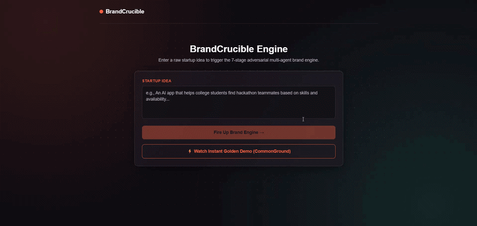
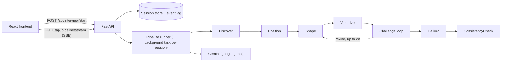

# BrandCrucible
 
> An adversarial branding engine. It turns a rough startup idea into a launch-ready brand kit through a multi-stage AI pipeline that challenges its own weak ideas.
 
[](https://github.com/jazzz2507/BrandCrucible/actions/workflows/ci.yml)


 
**Live API:** https://brandcrucible-api.onrender.com
**Live demo (frontend):** https://brand-crucible.vercel.app
 
> The API runs on a free Render tier, so the first request after idle can take about 30 seconds to wake up. The "Watch Instant Golden Demo" button replays a real, precomputed run without waiting.
 


 
 
 
Started during the WCC hackathon (Inkloom brand-system challenge) and continued as a portfolio project.
 
---
 
## The problem
 
Asking one AI prompt to "name my startup" gives generic output: clichéd names, vague positioning, and a tagline that doesn't match the voice. BrandCrucible treats branding as a pipeline of decisions, where each stage builds on the previous one and a dedicated agent tries to reject weak work before it ships.
 
## How it works
 
A founder submits an idea. The backend runs seven stages in order and streams progress to the client over Server-Sent Events.
 
| # | Stage | What it decides |
|---|-------|-----------------|
| 1 | **Discover** | Audience, problem statement, constraints, assumptions, open questions |
| 2 | **Position** | Value proposition, differentiators, competitive angle, positioning statement |
| 3 | **Shape** | Name candidates (with rationale and risk), personality, tagline options, voice |
| 4 | **Visualize** | Color, typography and imagery direction |
| 5 | **Challenge** | Scores every name and tagline, sends weak ones back for revision |
| 6 | **Deliver** | Compiles the chosen name and tagline plus all prior decisions into the brand kit |
| 7 | **ConsistencyCheck** | Audits the finished kit against the original idea |
 

 
### The Challenger loop
 
Each name and tagline candidate is scored from 0 to 10 on four dimensions: cliché risk (higher means more original), distinctiveness, audience fit, and consistency with the positioning. An item needs revision if any of these is true:
 
- the average score is below 6
- any single dimension is below 4
- the model's verdict is not `pass`
Weak items go back to the Shape stage with the Challenger's feedback, up to two revisions. The best-scoring attempt is kept, and final selection ranks `pass` candidates above any `revise` candidate, then by mean score.
 
**Example from a real run** (idea: a neighborhood tool library):
 
- `BlockBench` was **rejected** (scores 4, 3, 2, 2) because it "sounds like a fintech platform", and the loop sent it back for another revision.
- `CommonGround` came out of the revision loop and **passed** (7, 8, 9, 9).
- The tagline went through several revisions before "Your neighborhood hardware reserve. Borrow what you need, store nothing." passed (8.0, 7.5, 8.5, 9.0). The final consistency check scored 9.5 / 10.
The full reasoning is available per session at `/api/trace/{session_id}` (34 trace entries in that run).
 
## Reliability engineering
 
The interesting part of this project is making an LLM pipeline behave like a dependable service.
 
- **Structured output:** every stage returns JSON validated against a Pydantic v2 model, passed to Gemini as a response schema. Keywords Gemini rejects are stripped from the schema before sending.
- **Retries with backoff:** `429` waits for Gemini's suggested delay plus 1 second (otherwise 20, 40, then 60 seconds, max 3 retries). `503` and network errors back off `min(attempt * 15, 60)` seconds. Validation failures retry with a repair note, up to 8 attempts. `400`, `401`, `403` and `404` fail fast with no retries.
- **Reconnect-safe streaming:** the pipeline runs in a background task per session, independent of the HTTP connection. Every SSE event has an `id`, and a client that reconnects with `Last-Event-ID` resumes where it left off without starting a second run.
- **Quota protection:** idea length limits, per-IP rate limiting, a cap on concurrent pipelines with a bounded wait queue, a pipeline timeout, and session expiry.
- **Fallback:** a `golden-demo` session replays a real, fully validated run instantly, so the demo works even if the model API is down or rate-limited.
- **Observability:** every model attempt, including failures, is recorded in the session trace.
## API
 
| Method | Path | Purpose |
|--------|------|---------|
| `GET` | `/health` | Health check |
| `POST` | `/api/interview/start` | Body `{"idea": "..."}`. Creates a session and returns its `sessionId` |
| `GET` | `/api/pipeline/stream/{session_id}` | SSE stream of pipeline progress |
| `GET` | `/api/brand-kit/{session_id}` | The finished brand kit |
| `GET` | `/api/trace/{session_id}` | Every prompt, response and error for the session |
| `GET` | `/api/export/{session_id}` | Brand kit as a Markdown download |
 
Use the session id `golden-demo` on any of these to get a precomputed result without calling the model.
 
**SSE events**
 
| Event | Payload |
|-------|---------|
| `queued` | `{sessionId, position}` while waiting for a free pipeline slot |
| `stage_start` | `{sessionId, stage, index, total}` |
| `stage_complete` | `{sessionId, stage, index, total, output}` |
| `done` | `{brandKit, consistencyCheck, trace}` |
| `error` | `{message}` |
 
### Try it without an API key
 
```bash
curl -N https://brandcrucible-api.onrender.com/api/pipeline/stream/golden-demo
curl https://brandcrucible-api.onrender.com/api/export/golden-demo
```
 
On Windows PowerShell, use `curl.exe` instead of `curl`.
 
## Run locally
 
```bash
git clone https://github.com/jazzz2507/BrandCrucible.git
cd BrandCrucible/api
python -m venv venv
source venv/bin/activate        # Windows: venv\Scripts\activate
pip install -r requirements.txt
```
 
Create `api/.env`:
 
```
GEMINI_API_KEY=your-key
GEMINI_MODEL=gemini-3.5-flash-lite
USE_MOCK_LLM=false
```
 
Then start the server:
 
```bash
uvicorn main:app --reload
```
 
Set `USE_MOCK_LLM=true` to run the whole flow with placeholder stage output and no API key.
 
### Configuration
 
| Variable | Default | Meaning |
|----------|---------|---------|
| `GEMINI_API_KEY` | none | Required when `USE_MOCK_LLM=false` |
| `GEMINI_MODEL` | `gemini-3.5-flash-lite` | Model used for every stage |
| `USE_MOCK_LLM` | `true` | Use placeholder stage output instead of calling Gemini |
| `ALLOWED_ORIGINS` | open | CORS origins |
| `MAX_IDEA_CHARS` | 500 | Maximum idea length |
| `RATE_LIMIT_SESSIONS_PER_HOUR` | 5 | Per-IP session creation limit |
| `MAX_CONCURRENT_PIPELINES` | 2 | Pipelines running at once |
| `MAX_QUEUE_LENGTH` | 5 | Runs allowed to wait for a slot |
| `SESSION_TTL_HOURS` | 24 | How long finished sessions are kept |
| `PIPELINE_TIMEOUT_SECONDS` | 600 | Hard timeout for one run |
 
## Tests
 
```bash
cd api
pip install -r requirements-dev.txt
pytest
```
 
31 tests run on every push through GitHub Actions. They cover the revision gatekeeper and its boundaries, candidate ranking, the Challenger loop with a fake model, the retry and backoff schedules, rate limiting, concurrent listeners on one session, and `Last-Event-ID` replay. None of them call the real API.
 
## Repository layout
 
```
api/      FastAPI backend: SSE streaming, sessions, Gemini client, Challenger loop, tests
ai/       Original Node.js prototype of the pipeline, with the prompts and schemas (see HANDOFF.md)
web/      React + TypeScript + Vite + Tailwind frontend
content/  Launch and demo material
```
 
## Limitations
 
- **The model grades its own work.** The Challenger and ConsistencyCheck use the same model family that generated the output, so scores are a useful heuristic, not ground truth.
- **Sessions live in memory** and are lost when the server restarts. The `golden-demo` session is always available.
- **Free-tier quotas** limit throughput, which is why concurrency and rate limits are enforced.
- **Color swatches in the UI are derived from the text color direction,** not generated as structured hex values, so they are an approximation.
- **Name availability and trademarks are not checked.**
## Team
 
Built by a four-person team. My part was the backend: the FastAPI service, streaming, session handling, Gemini integration, reliability work, tests, CI and deployment.
 
- Backend & integration: Jashwanth S
- AI pipeline design and prompts: Harsshini P
- Frontend: Harish K
- Product and content: Harine S
 
 